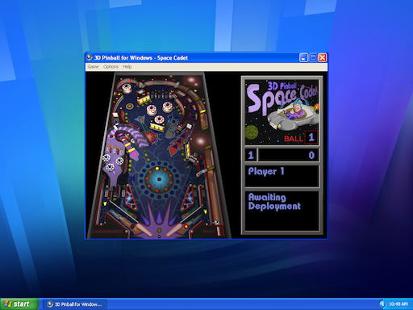

# Space Cadet Pinball (Installer)

> __Important Note__: This repository uses [Git LFS](https://docs.github.com/en/repositories/working-with-files/managing-large-files/installing-git-large-file-storage)

## Introduction
As a software developer I've written lots of code before but I wanted to tackle an interesting problem: _"how do I get pinball onto a relatives PC without giving them complex instructions?"_ and thus the idea of writing an installer was born. This repository serves both as a personal tech reference/demo of working NSIS code as well as public solution where anyone can contribute/help out if they have passion for Window's classic Pinball game.

### Screenshots

#### Installer Pages

|  |  |  |  |  |
| :---------------------: | :---------------------: | :---------------------: | :---------------------: | :---------------------: |

#### Pinball on Windows

|  |  |  |
| :-------------------------: | :----------------------------: | :--------------------------: |
|   Windows XP    | Windows 7 32-bit  | Full Tilt! on Win 10 64-bit |

### Project Aims, Features and Background
- Single ```.exe``` to install 3D Pinball for Windows on a modern (Windows 10/11) PC
- K4zmu2a modern SDL-based executables for both x86 and x86-64 platforms
- Start Menu, Desktop Shortcut, Add/Remove Programs, and an Uninstaller

### Prerequisites & Build Instructions

#### 1. NSIS (Nullsoft Scriptable Install System)
- [Download NSIS](https://nsis.sourceforge.io/Download) from Sourceforge (currently [v3.08](https://prdownloads.sourceforge.net/nsis/nsis-3.08-setup.exe?download))
- Add NSIS (Specifically ```makensis.exe``` to system ```PATH```)

#### 2. Windows XP's ```PINBALL.EXE``` files
- Available from the [Internet Archive](https://archive.org/details/3d-pinball-space-cadet_202103), download, unpack and locate/move using PowerShell:

  ```powershell
  # Download, Unpack, and Place PINBALL.EXE Files (with Clean-Up)
  # Assumes execution from project root
  Invoke-WebRequest -Uri 'https://archive.org/download/3d-pinball-space-cadet_202103/3D%20Pinball%20Space%20Cadet.zip' -OutFile '3DPinballSpaceCadet.zip' ; Expand-Archive '3DPinballSpaceCadet.zip' xp-files ; xcopy 'xp-files\3D Pinball Space Cadet\' 'installer\assets\software\Pinball\' ; rm -rf '3DPinballSpaceCadet.zip' ; rm -rf 'xp-files\'
  ```

- Verify checksums

  ```powershell
  # Assumes execution from project root
  start 'installer\assets\software\Pinball\checksum.sha1'
  ```

### 3. Latest  [k4zmu2a/SpaceCadetPinball](https://github.com/k4zmu2a/SpaceCadetPinball/releases) release (currently [v2.0.1](https://github.com/k4zmu2a/SpaceCadetPinball/releases/tag/Release_2.0.1))

  > __Note__: Installer requires both x32/x86 and x64/x86-64 decompilations to be stored in _assets/software_ folder correctly

- Download and unpack using PowerShell:

  ```powershell
  # Download, Unpack, and Place x86-64 k4zmu2a Files (with Clean-Up)
  # Assumes execution from project root
  Invoke-WebRequest -Uri 'https://github.com/k4zmu2a/SpaceCadetPinball/releases/download/Release_2.0.1/SpaceCadetPinballx64Win.zip' -OutFile 'SpaceCadetPinballx64Win.zip' ; Expand-Archive 'SpaceCadetPinballx64Win.zip' 'installer\assets\software\SpaceCadetPinballx64Win\' ; rm -rf 'SpaceCadetPinballx64Win.zip'

  # Download, Unpack, and Place x86 k4zmu2a Files (with Clean-Up)
  # Assumes execution from project root
  Invoke-WebRequest -Uri 'https://github.com/k4zmu2a/SpaceCadetPinball/releases/download/Release_2.0.1/SpaceCadetPinballx86Win.zip' -OutFile 'SpaceCadetPinballx86Win.zip' ; Expand-Archive 'SpaceCadetPinballx86Win.zip' 'installer\assets\software\SpaceCadetPinballx86Win\' ; rm -rf 'SpaceCadetPinballx86Win.zip'
  ```

- Verify checksums
  ```powershell
  # Assumes execution from project root
  start 'installer\assets\software\SpaceCadetPinballx64Win\checksum.sha1'
  start 'installer\assets\software\SpaceCadetPinballx86Win\checksum.sha1'
  ```

### 4. ___Optional__:_ Full Tilt! Pinball - Space Cadet Files

  > __Note__: Installer will compile without these files with a graceful warning: ```1 warning: 7010: File: "software\CADET\*.*" -> no files found. (.\space-cadet-pinball.nsi:83)```. This is expected behaviour as these files are not on the open internet

- Download and unpack to ```./Software/CADET/```:
- Verify checksums
  ```powershell
  # Assumes execution from project root
  start 'installer\assets\software\CADET\checksum.sha1'
  ```

### 5. Check project structure
- Folder structure should resemble the following ```tree```:
  ```
  space-cadet-pinball-installer
  │   .gitattributes
  │   .gitignore
  │   LICENCE
  │   README.md
  │
  └───installer
      │   space-cadet-pinball-installer.nsi
      │
      └───assets
          │   header.bmp
          │   installer-licences.txt
          │   wizard.bmp
          │
          ├───icon
          │       pinball.ico
          │
          └───software
              ├───CADET
              │   │   CADET.BMP
              │   │   CADET.DAT
              │   │   CADET.EXE
              │   │
              │   └───SOUND
              │           SOUND1.WAV
              │           SOUND104.WAV
              │           SOUND105.WAV
              │           SOUND108.WAV
              │           ...
              │           SOUND9.WAV
              │           TABA1.MDS
              │           TABA2.MDS
              │           TABA3.MDS
              │
              ├───Pinball
              │       FONT.DAT
              │       PINBALL.DAT
              │       PINBALL.EXE
              │       PINBALL.MID
              │       PINBALL2.MID
              │       SOUND1.WAV
              │       SOUND104.WAV
              │       ...
              │       SOUND9.WAV
              │       SOUND999.WAV
              │       table.bmp
              │       wavemix.inf
              │
              ├───SpaceCadetPinballx64Win
              │       SDL2.dll
              │       SDL2_mixer.dll
              │       SpaceCadetPinball.exe
              │
              └───SpaceCadetPinballx86Win
                      SDL2.dll
                      SDL2_mixer.dll
                      SpaceCadetPinball.exe
  ```

### 6. Create the installer using _makensis_
- Execute makensis
  ```powershell
  # Build installer, assumes execution from project root
  makensis '.\installer\space-cadet-pinball-installer.nsi'
  ```
- .exe is created in the ```installer``` (.nsi) directory

  

- Enjoy 😎


---
## 3D Pinball for Windows - Space Cadet: A Brief History

### Windows 95, Full Tilt! and Windows XP


_3D Pinball for Windows – Space Cadet_ was a pinball video game that was included with Windows XP. The development of _3D Pinball for Windows_ can be traced back to the 1990s when Microsoft partnered with Cinematronics (a pinball manufacturer) and Maxis (Software Publisher) to create a pinball game for _Microsoft Plus! for Windows 95_.

#### Full Tilt! Pinball for Windows 98


Cinematronics & Maxis then released _Full Tilt! Pinball_ as a full featured game for Windows 98. _Full Tilt!_ featured multiple themed pinball tables with immersive gameplay, including realistic physics, interactive elements, and challenging missions.


This enhanced version of the "Space Cadet" pinball game came with two new tables (Skullduggery and Dragon's Keep) and included new missions and functionality not available in the "stock" Windows versions.

#### Windows XP


Microsoft ([David Plummer](https://github.com/davepl)) successfully ported the code to Windows XP, but modern UI developments and the 64-bit shell, combined with time pressures releasing the new Windows Vista operating system confined Pinball to the recycle bin from that release forward. ```Pinball.exe``` (the name of the _3D Pinball for Windows – Space Cadet_ executable) still works with modern (even 64-bit) versions of Windows but this code starts to look dated when viewed through a 2023 lens.

### k4zmu2a/SpaceCadetPinball


Enter K4zmu2a, who's decompilation project provides access to the game's source code and assets, allowing developers to understand how the game functions and potentially modify or enhance it. K4zmu2a has made a number of improvements, including the ability to load high-resolution textures from _Full Tilt!_ and allowing the game windows to be resized. This project uses SDL aiding portability across platforms, including Windows 10 x86 and x86-64 platforms. For detailed instructions on how to use and integrate this decompiled version of 3D Pinball for Windows into your own projects, please refer to the documentation provided by [K4zmu2a](https://github.com/k4zmu2a).

---
## Copyright Notice(s)
- Screenshots/Images are used under "fair use" guidelines
- Compiled software is utilised as made available in the Public Domain, including GitHub and the Internet Archive project. All rights reserved by their respective copyright holders:
  - Microsoft
  - Maxis
  - Cinematronics
  - K4zmu2a

---
## Contributing to this Project
This project welcomes contributions of all types. We ask that before you start work on a feature that you would like to contribute, please read the [Contributor's Guide](.github/CONTRIBUTING.md).

---
## Security Policy for this Project
This project seeks to build secure, versatile and robust portable software. If you find an issue, please report it following the [Security Policy](.github/SECURITY.md)

---
## Thanks & Useful Links

#### People
- Andrey Muzychenko ([k4zmu2a](https://github.com/k4zmu2a)) for their great decompilation / pinball reverse-engineering project and binaries
- David Plummer ([davepl](https://github.com/davepl)) for their YouTube channel and porting 3D Pinball to Windows XP all those years ago

#### Software
- The [NSIS](https://nsis.sourceforge.io/Main_Page) Project
- [Paint.net](https://getpaint.net/) for Image editing
- [IcoFx Portable](https://portableapps.com/apps/graphics_pictures/icofx_portable) for Icon file editing
- SHA-1 (.sha1) files generated using [TeraCopy](https://www.codesector.com/teracopy)

#### Further Reading
- [Full Tilt! Pinball](https://en.wikipedia.org/wiki/Full_Tilt!_Pinball) on Wikipedia
- [Microsoft Plus!](https://en.wikipedia.org/wiki/Microsoft_Plus!) on Wikipedia


#### Online Useful Links/Guides
- Notepad++'s NSIS Source Code: https://github.com/notepad-plus-plus/notepad-plus-plus/tree/master/PowerEditor/installer
- Estimating install directory size: https://nsis.sourceforge.io/Add_uninstall_information_to_Add/Remove_Programs
- Accessing the 64-bit (non-wow) version of the Registry: https://stackoverflow.com/questions/50649571/how-to-force-readregstr-to-read-32bit-node
- Override desktop shortcut icon: https://stackoverflow.com/questions/9317007/how-to-create-an-icon-shortcut-with-nsis#9318296
- Merging x86 and x86-64 into one installer example: https://stackoverflow.com/questions/21822044/merge-32bit-and-64bit-installer-into-one-installer-using-nsis#21823968
- x86-64 program files: https://nsis.sourceforge.io/Reference/$PROGRAMFILES
- Matching splash screen font: https://www.myfonts.com/collections/quadrat-serial-font-softmaker?tab=individualStyles

---
## File Lists & Checksums

<details>
<summary>Windows XP / PINBALL.EXE files</summary>

| File               | SHA-1                                          |
| ------------------ | ---------------------------------------------- |
| ```FONT.DAT```     | ```42F2125C5DFFAC2560FDF486F2A49BF7E5CE5839``` |
| ```PINBALL.DAT```  | ```C1A616EDB0985CF8AADFB2A1029DADAE16CDFCC5``` |
| ```PINBALL.EXE```  | ```2A5B525E0F631BB6107639E2A69DF15986FB0D05``` |
| ```PINBALL.MID```  | ```3DFC2B292D96F38AD4CD4D948D751BA48A45DDBD``` |
| ```PINBALL2.MID``` | ```6A9CF79D387A318D04DA480B7F4D5B4C03876B74``` |
| ```SOUND1.WAV```   | ```DFE41D51A938ECFAE109BBBC61A123591E41B327``` |
| ```SOUND104.WAV``` | ```F8ACD7E01A57238B9E7BDC66EF3FC543BC0C4F7B``` |
| ```SOUND105.WAV``` | ```B09398237B6439609AAC3CC56ED570E0A4AFD555``` |
| ```SOUND108.WAV``` | ```362823FCF19B32D4488EB943833EEB6846732F6F``` |
| ```SOUND111.WAV``` | ```08540944E8D475814991CC643CC97CD6F82665CC``` |
| ```SOUND112.WAV``` | ```5991DABB2969F149AD4B5FDEA2784E9F69AE6CA2``` |
| ```SOUND12.WAV```  | ```83A2AADF3BF8AFAA328F448BEAF79DF76C7C09F1``` |
| ```SOUND13.WAV```  | ```6750B4B9130EC9DC41DF9AC6290FCDF987D8B72C``` |
| ```SOUND131.WAV``` | ```961F182053DE9C85825B1A6CB29EC6576D708D75``` |
| ```SOUND136.WAV``` | ```49366D7FB78656DEFF1907CED0A91D3CB5867F99``` |
| ```SOUND14.WAV```  | ```3634223359F1FF17533CF616069015C2A0E3051A``` |
| ```SOUND16.WAV```  | ```A4ABD710CC2A64CB2D0C0779228C0EE4C568532B``` |
| ```SOUND17.WAV```  | ```A2353017387FAB74062A72BA153D93C5855E30E7``` |
| ```SOUND18.WAV```  | ```6D029C7A90A0BA60E22592C9FF7B4C4EF308C6BF``` |
| ```SOUND181.WAV``` | ```096A83495389F610F7B26B7E51ED87C69C292FBE``` |
| ```SOUND19.WAV```  | ```A784BE434F01C4F36FC3FACAD9285B67801F92C4``` |
| ```SOUND20.WAV```  | ```0408B9C258DF424586AC2AF4E074224E502AA328``` |
| ```SOUND21.WAV```  | ```E547DE35A94EAC2D72A6DB634A05BF35D615E201``` |
| ```SOUND22.WAV```  | ```62E121B9178172FD5E7869566C7D998B12B0AE80``` |
| ```SOUND24.WAV```  | ```0483FCD451E86650720156EB821E6C09BAADFA30``` |
| ```SOUND240.WAV``` | ```2771FBBB49EE9DED5D4C4FC60552A85732E7C08A``` |
| ```SOUND243.WAV``` | ```AD6F57E531DFC6611970F8F431FDCB542F4719A1``` |
| ```SOUND25.WAV```  | ```2F0C2A9D0C688E19D24602A525EE5E0883D7D7D0``` |
| ```SOUND26.WAV```  | ```B00CFB19C98C42E9CC5EFDE516A6CF67D5271F19``` |
| ```SOUND27.WAV```  | ```D403214AEB68CCB48C156332D1E28F60A1864181``` |
| ```SOUND28.WAV```  | ```042A41DEDE73A6A62EDF143BFFC54A46E195452D``` |
| ```SOUND29.WAV```  | ```6DB09C6C9F728ADA8A6A9A17AEA456AD7E3DF5C9``` |
| ```SOUND3.WAV```   | ```CF7A88A5035E9E0DD1FE830511910778C79D89A9``` |
| ```SOUND30.WAV```  | ```F3AC1CDDCE6B1E754C8A3536BCB6CE895FCCCE8C``` |
| ```SOUND34.WAV```  | ```8A57C85AD19A0E3E5F31A1E2FC795FDA8EE625F0``` |
| ```SOUND35.WAV```  | ```69E2787400C9CEF9B27D315096657C4FE284AA9B``` |
| ```SOUND36.WAV```  | ```1752C3EE6D6477BA4907CB6B3F6D6983CAE70303``` |
| ```SOUND38.WAV```  | ```CAD6DECE9EF1D737FEC21BE8023AFE7DEFBD79CE``` |
| ```SOUND39.WAV```  | ```1DA85C474C35F5867A37EE03194D5C5BB4C3A82F``` |
| ```SOUND4.WAV```   | ```0D522EB3B12B8973C1A69E6A0867A98E4BCF4A33``` |
| ```SOUND42.WAV```  | ```32751DE38985EE954E347F9C21A44BBFE52897B6``` |
| ```SOUND43.WAV```  | ```FF5B397F63F5AA69155797C3313B42CD7AE58A88``` |
| ```SOUND45.WAV```  | ```7C663440910F156BD0B4A5D1831408EDC21D91E8``` |
| ```SOUND49.WAV```  | ```297645858FD7C2A4B2B4EE19A85576637C29D073``` |
| ```SOUND49D.WAV``` | ```34894BEB860AAFB467CFBF6B0A4B1C17F3322C62``` |
| ```SOUND5.WAV```   | ```751794A51BD5B072FA9C082C6FE730FF7C384C89``` |
| ```SOUND50.WAV```  | ```A3777E78B4A3E9B65905C56C6E331F2038130953``` |
| ```SOUND528.WAV``` | ```599E59A609BEC4A17146621199115CAD9C30E3EE``` |
| ```SOUND53.WAV```  | ```439D64ABA69115BE2C119AD9991D54829778F8F4``` |
| ```SOUND54.WAV```  | ```1FAF14E33F7ED6AA736C9F26A3161DC23F35BFD6``` |
| ```SOUND55.WAV```  | ```77380A92F99DB5207C324077EC476659781DA8AD``` |
| ```SOUND560.WAV``` | ```BFF770A6488648978E1F109ABE8801918EF8E98D``` |
| ```SOUND563.WAV``` | ```2FFE98A3E1DC774DB00467D2F9006738CE30198C``` |
| ```SOUND57.WAV```  | ```5FB7BBDA9799BCC6D0F7E1F7905A28A18210F5B3``` |
| ```SOUND58.WAV```  | ```B7D5945A1150B9A90E8C6236A3608315CC94D249``` |
| ```SOUND6.WAV```   | ```8E2ABCA9815753506CCBF5489D3556BE773F69AB``` |
| ```SOUND65.WAV```  | ```1E5D331C32772C3F0242C30AA46969E5C948AB14``` |
| ```SOUND68.WAV```  | ```D0B32BDDAC7312E70656E2BE1CA0202E6446CE6A``` |
| ```SOUND7.WAV```   | ```A6C979787F55C7FBD35029C2F866E7D7728BB353``` |
| ```SOUND713.WAV``` | ```CAB89CCB0F626623624BB2E8D3369E75A7368AB0``` |
| ```SOUND735.WAV``` | ```489E02F4E6E96965A7BAF7E396DFEB83AC1C7554``` |
| ```SOUND8.WAV```   | ```C5B611E741004610964999F32BBD4349D8E2B825``` |
| ```SOUND827.WAV``` | ```30688782A8782D4188E648198C4FDF1FB6B873C8``` |
| ```SOUND9.WAV```   | ```B60817955AA87E869ED440E84FDB92DBED844C8A``` |
| ```SOUND999.WAV``` | ```B58E5919BCD6BAB78620CE8FD21E0270F80B9AC4``` |
| ```table.bmp```    | ```FFFAE772D2B7082EEA3421B7CABAE84E34546A09``` |
| ```wavemix.inf ``` | ```626787F0E42D4AFCFE55253B15CA6D102665D9D6``` |

</details>

<details>
<summary>Full Tilt! Pinball / CADET files</summary>

| File                      | SHA-1                                          |
| ------------------------- | ---------------------------------------------- |
| ```*CADET.BMP```          | ```12C634A386AE147F4F371A2EBCB1010F8F69115E``` |
| ```*CADET.DAT```          | ```DD81B3488D6DAA14584788BD2A045E08C820597B``` |
| ```*CADET.EXE```          | ```3F7B5699074B83FD713657CD94671F2156DBEDC4``` |
| ```*SOUND\SOUND1.WAV```   | ```71E1D40A006B405A186EB587D577F57940CF2A6E``` |
| ```*SOUND\SOUND104.WAV``` | ```55FB3E2C3483B424AF1727C7EC0E6EB43F6EDC31``` |
| ```*SOUND\SOUND105.WAV``` | ```AB8384D8B1F3253513736D5289E6CD00630690A6``` |
| ```*SOUND\SOUND108.WAV``` | ```55AD507C1973A6FB007D3F167850D49C7BF00E8B``` |
| ```*SOUND\SOUND12.WAV```  | ```8B4E5DA1B7990EF26BB6A4BE87C24A0A3FDDDB1A``` |
| ```*SOUND\SOUND131.WAV``` | ```42E23F7EE790E2DBC4BF9EC747075114C0609A2C``` |
| ```*SOUND\SOUND14.WAV```  | ```B0DC94477DF7C6B7DCC9031DA4085F821441722B``` |
| ```*SOUND\SOUND16.WAV```  | ```DAE404FF2B0FBBFA0865EA5DCCA8E3025BF03DA8``` |
| ```*SOUND\SOUND17.WAV```  | ```24D78F7B22CA489AD8D5E9EC545A04458E4480B9``` |
| ```*SOUND\SOUND18.WAV```  | ```3E9C6591582A331CF8DED6CB02B1A7B7E1BA49F8``` |
| ```*SOUND\SOUND19.WAV```  | ```A3B022452E309D228631677950E1095CE4A2F55F``` |
| ```*SOUND\SOUND20.WAV```  | ```FAD68A1144AAEE146648066009406017BD52B669``` |
| ```*SOUND\SOUND21.WAV```  | ```66D45F5B2F4FADFD9880B800D2B3F7B33D0E32B9``` |
| ```*SOUND\SOUND22.WAV```  | ```E22A8AF6B2A5E32A057569C858AC8406593DC2F7``` |
| ```*SOUND\SOUND24.WAV```  | ```11E1E9661D29BC6BC352703CC4E3CEC7F3ECE098``` |
| ```*SOUND\SOUND25.WAV```  | ```76280AB58CA21FB90847680B090DF2EAEC8834D5``` |
| ```*SOUND\SOUND26.WAV```  | ```F8C89A6A0A44365DB783E820C602BF1B6FFB627A``` |
| ```*SOUND\SOUND27.WAV```  | ```10E0C41A81576014B6F488055048D5A11703A085``` |
| ```*SOUND\SOUND28.WAV```  | ```0D55BACBC870C117B255EFC560D3820CD4434ABB``` |
| ```*SOUND\SOUND29.WAV```  | ```A219738E5E66CB320BCA38954CC5CEF795F1E4F5``` |
| ```*SOUND\SOUND3.WAV```   | ```C7E5D4974285667828AED0365F7930CAE3B37EB1``` |
| ```*SOUND\SOUND30.WAV```  | ```92D4775ABF21C8BB9F3D2C83B9C37563A57F5EE6``` |
| ```*SOUND\SOUND34.WAV```  | ```6DA9624508CE9B567D645DC39A49A461B5668891``` |
| ```*SOUND\SOUND35.WAV```  | ```0087B6AFAB4FDB502F8CB624432CEC18017F3F45``` |
| ```*SOUND\SOUND36.WAV```  | ```ACE9284647EEDDFDC529310C45EE9C5CA78108F0``` |
| ```*SOUND\SOUND38.WAV```  | ```DFD458556C420B02983B021DDC19D2CE64537504``` |
| ```*SOUND\SOUND39.WAV```  | ```D044F0141E7CAADF69E4F3451E52AB2AB72F3A1A``` |
| ```*SOUND\SOUND4.WAV```   | ```64A7382F7D1B5CC7BDF0B2382F46FF8949F1F3A4``` |
| ```*SOUND\SOUND42.WAV```  | ```32751DE38985EE954E347F9C21A44BBFE52897B6``` |
| ```*SOUND\SOUND43.WAV```  | ```F63BD70C855A49A4ED0B59B5B8D6A2793ACBD451``` |
| ```*SOUND\SOUND45.WAV```  | ```7134D022B31C6D78FA6A8E174AD89B5C69FF01E8``` |
| ```*SOUND\SOUND49.WAV```  | ```C1F909114CA8620EF9E0A3796BAF83E7B3086153``` |
| ```*SOUND\SOUND49D.WAV``` | ```4D829FE04EEEBDDC2FE42B0858D8A8BCAD1E2838``` |
| ```*SOUND\SOUND5.WAV```   | ```1DE57409C17A74917C70634A2A1FE955959360B3``` |
| ```*SOUND\SOUND50.WAV```  | ```E8DFCE349C594DD9DF36DCCD9B9CB39B627151E1``` |
| ```*SOUND\SOUND52.WAV```  | ```DF33F908964A38A56B86EA245CB1314CD149F631``` |
| ```*SOUND\SOUND54.WAV```  | ```BD8744E9BE9649697F969495FFD7B102B6F9BCA3``` |
| ```*SOUND\SOUND55.WAV```  | ```C12A26D7593A0D248FFF7F66A74F03CCB92483E0``` |
| ```*SOUND\SOUND57.WAV```  | ```D646E1E22671793D9CB6B52D253F3B8C7C27E65E``` |
| ```*SOUND\SOUND58.WAV```  | ```B7D5945A1150B9A90E8C6236A3608315CC94D249``` |
| ```*SOUND\SOUND7.WAV```   | ```9AB922189E01A02B5AE8493069988231640C0ACB``` |
| ```*SOUND\SOUND8.WAV```   | ```5D0A9E54CD0815E90D64EB9DC761BB9BA1FF92E5``` |
| ```*SOUND\SOUND9.WAV```   | ```8E4519A86B041FF73221613DCA30D8C53D4ECAD1``` |
| ```*SOUND\TABA1.MDS```    | ```2E2FD1465440DC779B0E6D8F662727B11E8B631C``` |
| ```*SOUND\TABA2.MDS```    | ```8C9A34B4244B9790DFB46F1043E28C2BC585C51C``` |
| ```*SOUND\TABA3.MDS```    | ```D6BA31702B2CA50E2375BD5F41151F02F8EC4585``` |

</details>

<details>
<summary>SpaceCadetPinballx64Win files</summary>

| File                        | SHA-1                                          |
| --------------------------- | ---------------------------------------------- |
| ```SDL2.dll```              | ```90295FE46BEE71FD6281555B2AFA3016D8284817``` |
| ```SDL2_mixer.dll```        | ```1D61D908BFA16CE80E8947100C5F3F936B579C44``` |
| ```SpaceCadetPinball.exe``` | ```36633D23707D07F9C0EC732E912DEB3FC4A0A402``` |

</details>

<details>
<summary>SpaceCadetPinballx86Win files</summary>

| File                        | SHA-1                                          |
| --------------------------- | ---------------------------------------------- |
| ```SDL2.dll```              | ```87DC7F544EAFF2CA22D9A0121876B8C9D30B405F``` |
| ```SDL2_mixer.dll```        | ```4A2DAF5C75639AAC0216D26B73EBBD7F9D8A22E8``` |
| ```SpaceCadetPinball.exe``` | ```6AE4C459199EE7AA9ACAB290986FB0C7104F3E1E``` |

</details>
